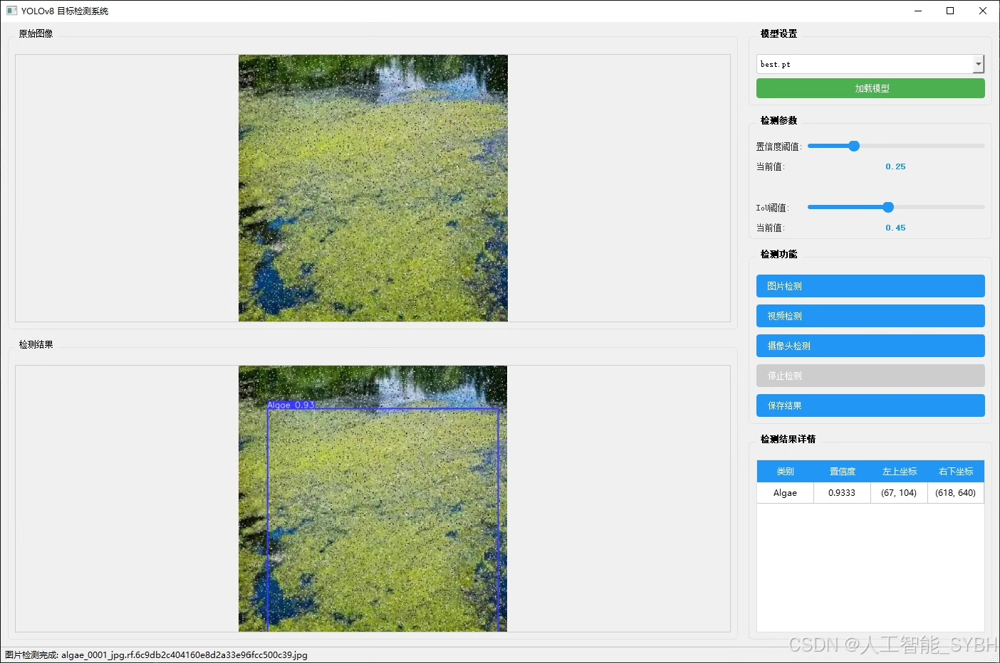
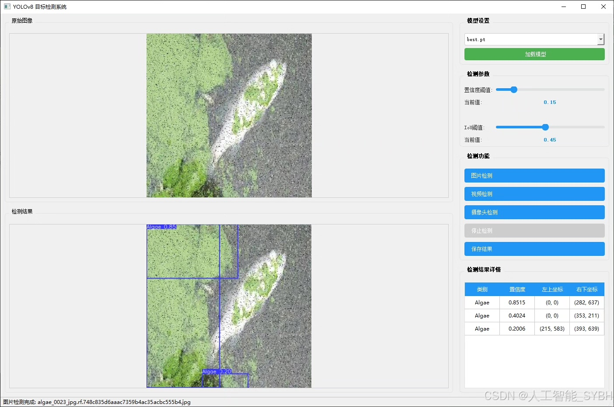
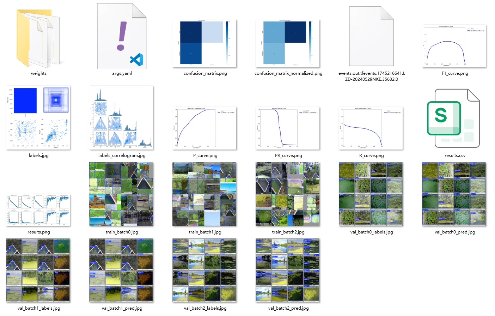
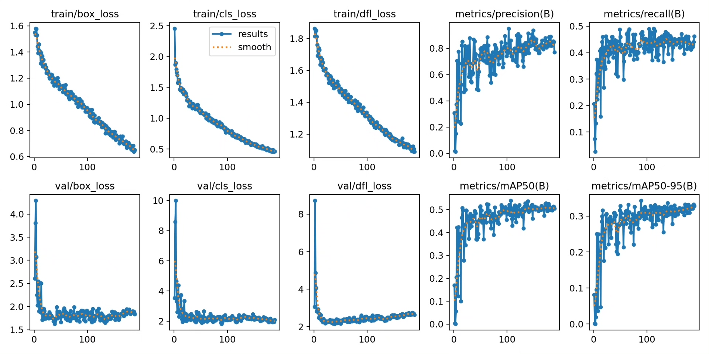
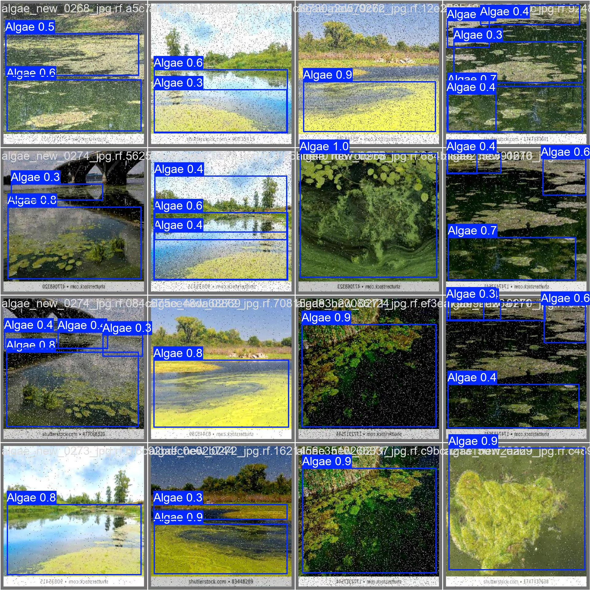
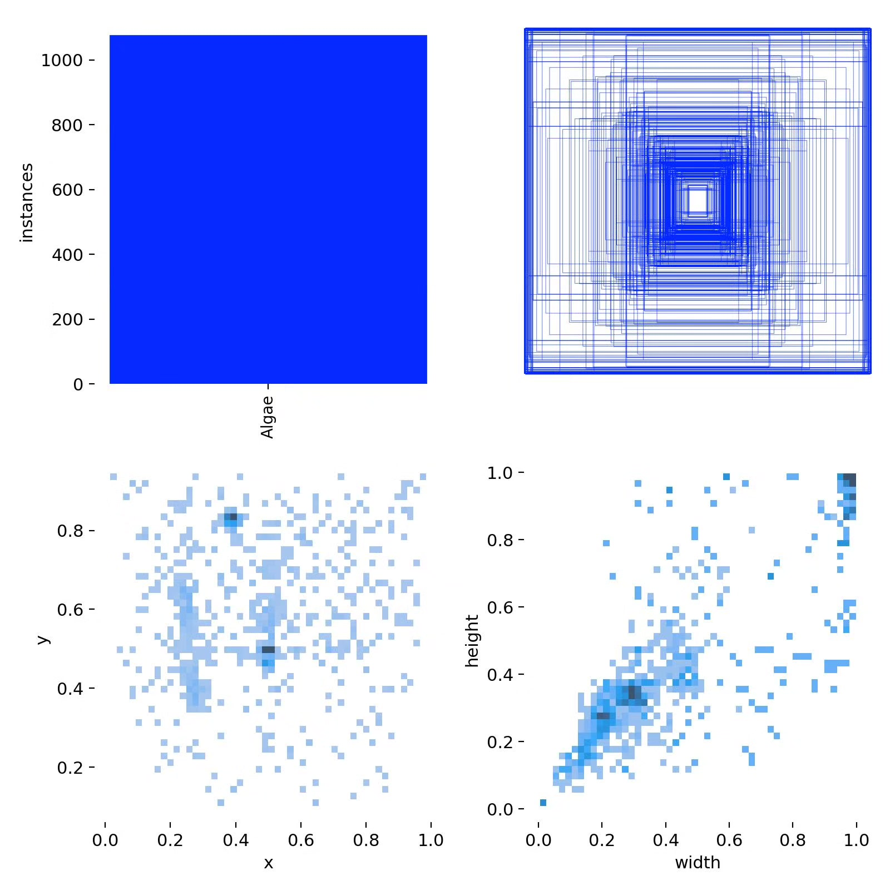
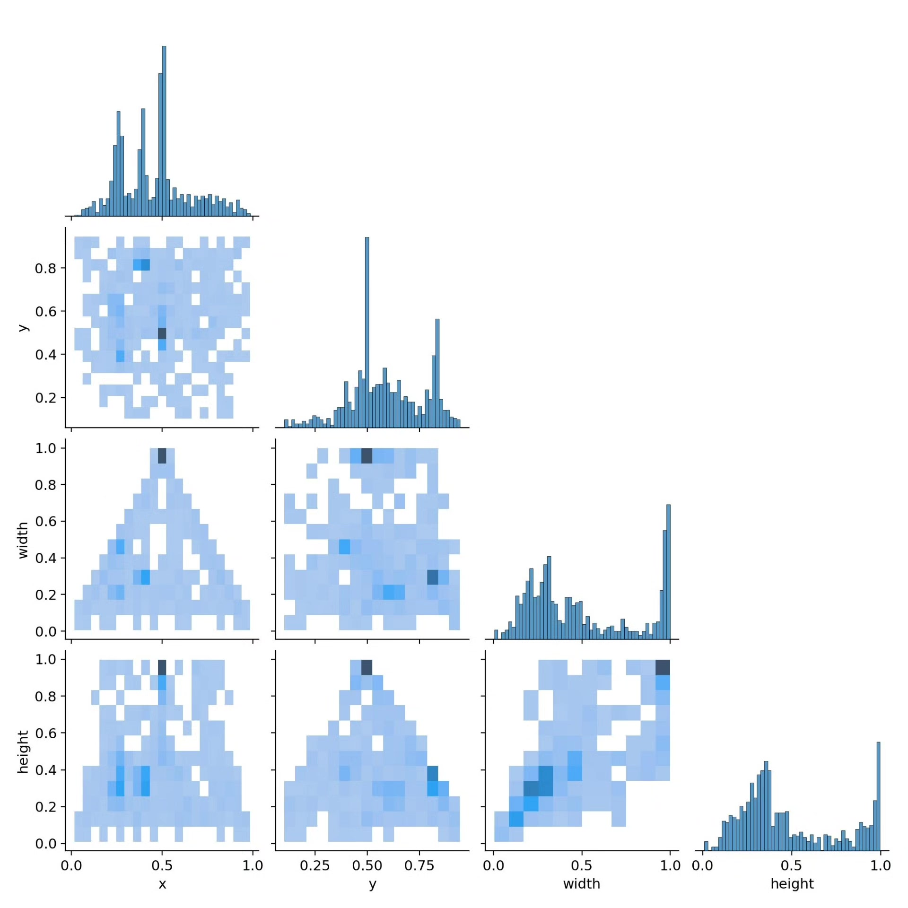
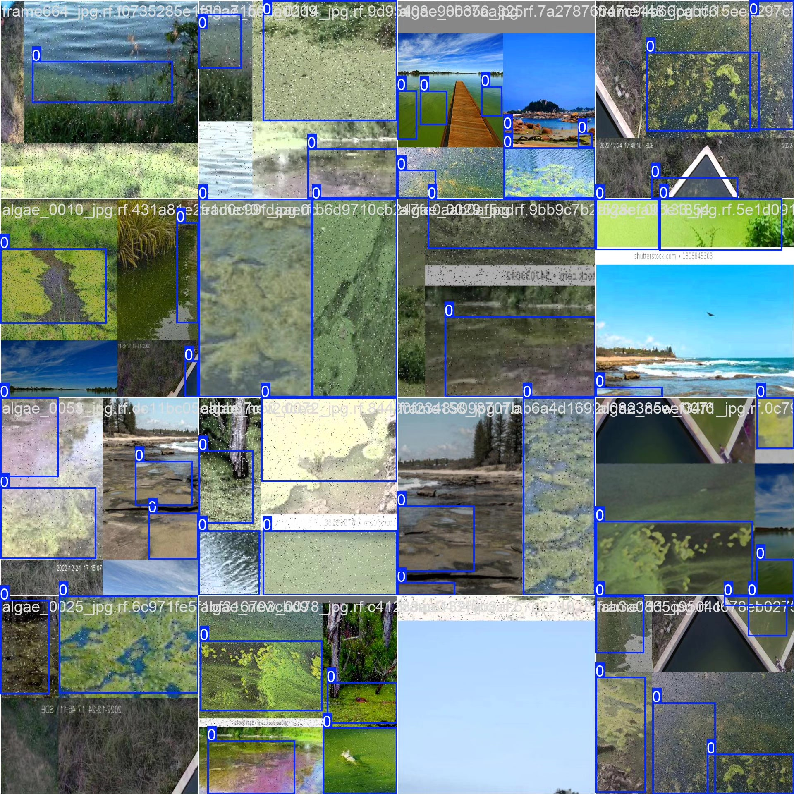

# YOLOv8-based water algae detection system based on deep learning (YOLOv8+YOL)

## Body

Based on the YOLOv8 deep learning target detection algorithm, this project has developed an efficient and precise water alga detection system, specifically for recognizing the distribution of algae in water bodies. The system is designed to detect only one category (water algae) and uses 704 training images and 344 validation images for model training. By integrating data augmentation, transfer learning, and model optimization techniques, it achieves high detection accuracy and robustness. This system can be deployed on drones, underwater robots, or fixed monitoring devices to monitor the growth of algae in water bodies in real-time, providing intelligent solutions for water quality management, environmental protection, and ecological research.

The company's products have been granted the official commercial license certification by YOLO.

We offer after-sales service.

After payment, we will provide a WeChat account for any questions you may have.

Environmental configuration: We will provide a tutorial on how to set up the environment, and WeChat will provide answers to questions.

Remote installation services: If you need remote configuration, an additional fee of 69 is required, with all fees refunded if the configuration fails (only the installation fee is refunded for older computers).

Retraining dataset: After setting up the environment, you can train on your own computer. If you need us to retrain, just pay 69 plus the computing power fee (2.5 yuan/hour).

Full after-sales service

## Images

## Payment

Here is a pay link on Stripe ( https://buy.stripe.com/3cs8yP7sY87d0vu9AB ). Please contact me lonlonago@foxmail.com after funding $89, and I will send you a complete data files , thank you!

